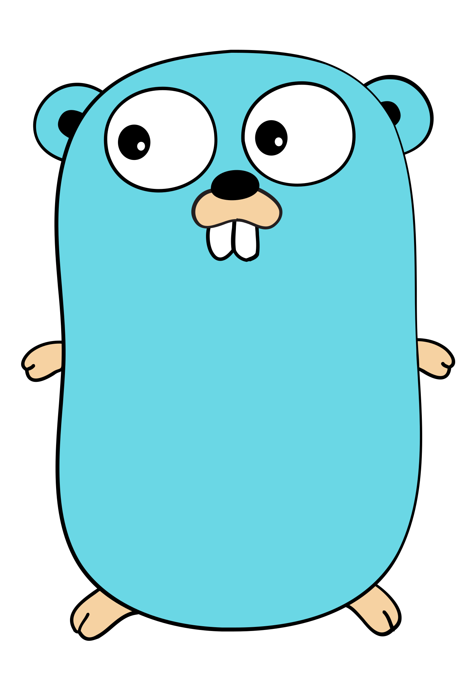

### Hello World! I'm Keynandz! 👋
---
### :fire: Coding Journey:

  

###

  
  
  

###

  
  
  
  
  
  
  
  
  
  
  
  
  
  
  
  
  
  
  
  
  
  
  
  
  
  
  
  
  
  
  
  
  
  
  
  
  
  
  
  
  

###

###

  

###
